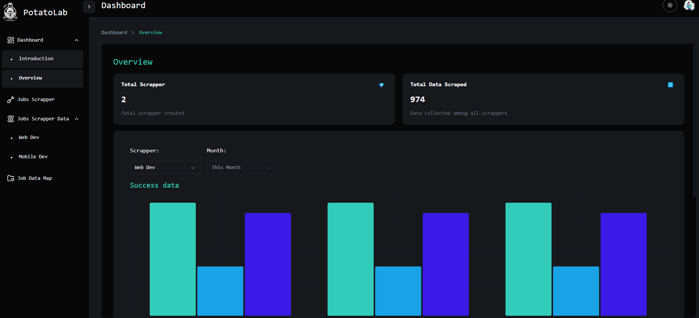
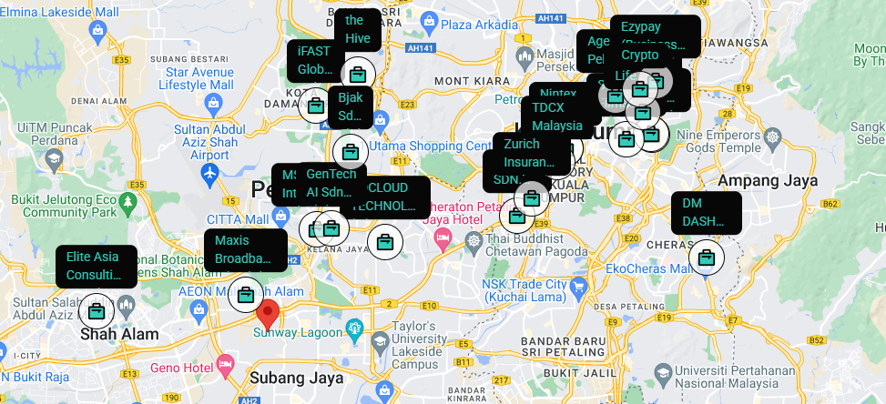

## 🤖 Who Am I

An enthusiastic full stack developer with a keen interest in exploring new technologies and continuously enhancing my skills. I am driven by a passion for creating efficient, scalable, and user-friendly applications that make a positive impact.

<a href="https://bobopotato.github.io/cshong/" target="_blank">Here is my first portfolio long time ago~</a>

## 📜 Tech Knowledge

## 🌱 I’m currently learning

## 🔭 I’m currently working on

A full-stack application that automates the whole process of collecting job postings from multiple job hunting platforms, and allows users to manage their personalized scheduler. https://github.com/bobopotato/potato-lab

## 📫 How to reach me:

<link
  rel="stylesheet"
  href="https://cdn.jsdelivr.net/gh/dheereshagrwal/colored-icons/src/app/ci.min.css"
/>
<a href="https://www.github.com/bobopotato" target="_blank"><i class="ci ci-github-light" style="margin-right: 10px; width:42px; height:42px"></i></a>
<a href="https://www.linkedin.com/in/chong-soon-hong-2b54171b9/" target="_blank"><i class="ci ci-linkedin" style="margin-right: 5px; width:48px; height:48px; translate: 0 5px;"></i></a>
<a href="https://wa.link/y73u5j" target="_blank"><i class="ci ci-whatsapp" style="margin-right: 10px; width:40px; height:40px"></i></a>

<!--
**bobopotato/bobopotato** is a ✨ _special_ ✨ repository because its `README.md` (this file) appears on your GitHub profile.

Here are some ideas to get you started:

- 🔭 I’m currently working on ...
- 🌱 I’m currently learning ...
- 👯 I’m looking to collaborate on ...
- 🤔 I’m looking for help with ...
- 💬 Ask me about ...
- 📫 How to reach me: ...
- 😄 Pronouns: ...
- ⚡ Fun fact: ...
-->
